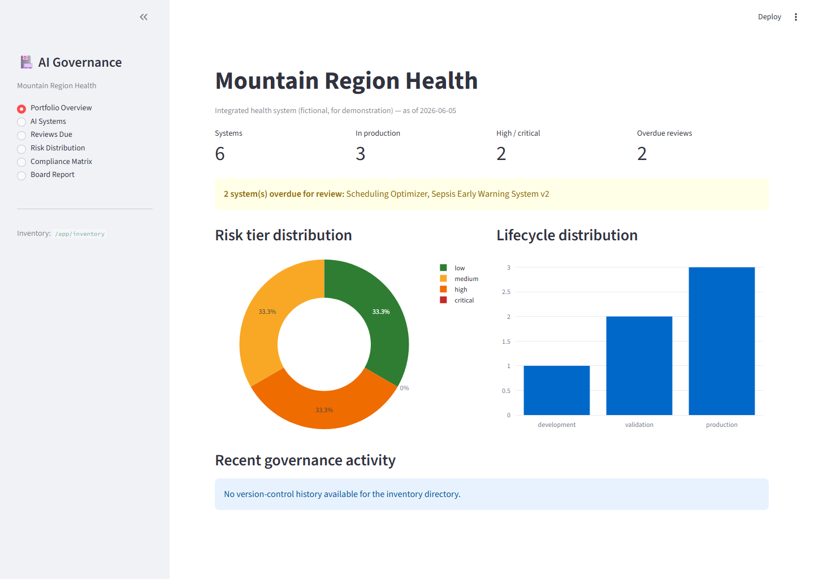
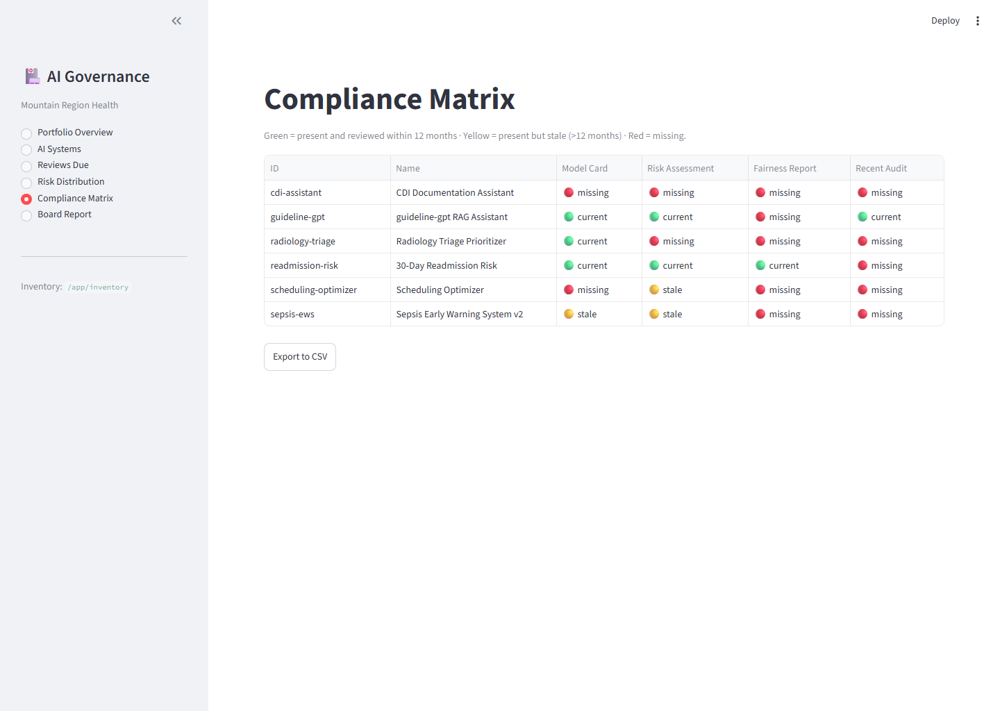
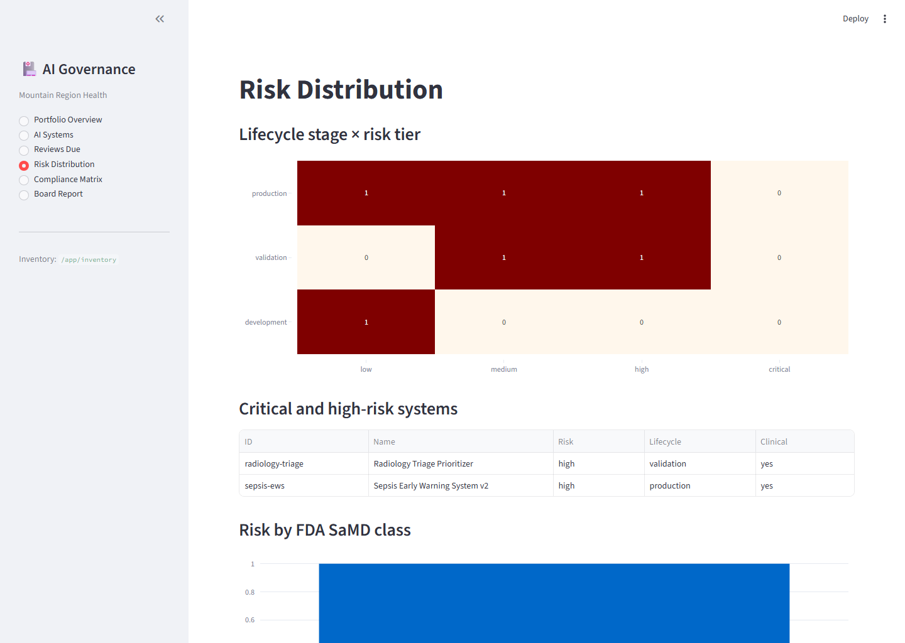
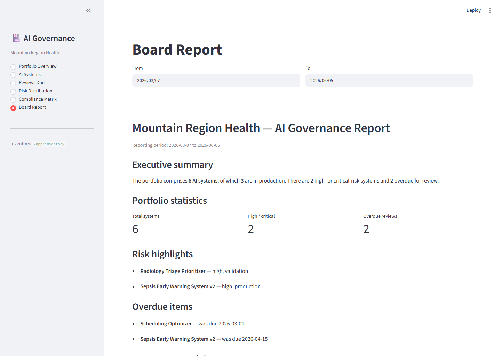

# healthcare-ai-governance

[](https://github.com/joshquigs11093/healthcare-ai-governance/actions/workflows/ci.yml)
[](LICENSE)
[](https://www.python.org/downloads/)
[](https://github.com/astral-sh/ruff)
[](https://mypy-lang.org/)

**Governance tooling for healthcare AI programs.** It produces the artifacts a
compliance officer, AI governance committee, or hospital board needs to review an
AI portfolio: a risk-classified system inventory, model cards, NIST AI RMF–mapped
risk assessments, fairness reports, and LLM output audits — tied together by a
dashboard and an executive board report.

> **This is a reference implementation, not a product, and not legal or compliance
> advice.** It implements the patterns referenced in current US healthcare AI
> guidance so a program can see "what good looks like" and get working tools
> without a platform purchase. Validated use in regulated operations requires
> independent legal and compliance review.

New to healthcare AI governance? Start with the **[primer](docs/primer.md)**.
Producing artifacts? See **[PRACTITIONERS.md](PRACTITIONERS.md)**.

## Quick start

```bash
docker compose up        # then open http://localhost:8501
```

The dashboard launches pre-loaded with a fictional demo organization, **Mountain
Region Health**, so it is useful the moment you clone the repo.

Or run locally:

```bash
uv pip install -e ".[dev]"        # or: pip install -e ".[dev]"
hag --help
hag inventory list
streamlit run src/healthcare_ai_governance/ui/dashboard.py
```

## What it produces

| Capability | What you get | Command |
|---|---|---|
| **System inventory** | Risk-classified registry in version control, validated against a schema | `hag inventory list\|show\|validate\|overdue\|compliance` |
| **Model cards** | Markdown / HTML / signed PDF, aligned to ONC HTI-1 source attributes | `hag model-card render` |
| **Risk assessments** | Deterministic, auditable risk tier mapped to NIST AI RMF, with mitigations and a signed PDF | `hag risk-assessment from-yaml` |
| **Fairness reports** | fairlearn-style metrics with bootstrap CIs across demographic & clinical slices, ROC/calibration charts | `scripts/generate_fairness_demo.py` |
| **Output audits** | PHI leakage, unsupported claims, jailbreak, tone, citation validity over LLM outputs | `hag audit run\|ci` |
| **Dashboard & board report** | Six-page Streamlit portfolio view + executive PDF | `docker compose up` |

## Architecture

The **inventory is the single source of truth**; every artifact links back to a
system by `system_id`. Each capability is usable standalone (CLI or library) and
writes to an artifact directory linked from the inventory.

```
inventory/systems/{id}.yaml ──┐  (source of truth, in git)
                              │
  model_card ────────────────►├─► artifacts/model_cards/
  risk_assessment ───────────►├─► artifacts/risk_assessments/
  fairness_report ───────────►├─► artifacts/fairness_reports/
  audit_reports ─────────────►├─► artifacts/audit_reports/
                              │
  governance_dashboard ◄──────┘  reads inventory + artifacts
  board_report ──────────────►   artifacts/board_reports/
```

Logic lives in non-UI modules shared by the CLI, dashboard, and tests. Heavy or
platform-specific dependencies (PDF, PII, fairness, LLM) are optional extras and
degrade gracefully when absent. Design rationale is in
[`docs/decisions/`](docs/decisions/) (six ADRs).

## Screenshots

> Regenerate with `docs/images/README.md`.

| Portfolio Overview | Compliance Matrix |
|---|---|
|  |  |

| Risk Distribution | Board Report |
|---|---|
|  |  |

## Regulatory context (as of mid-2026)

The toolkit is designed to stay useful regardless of how current uncertainty
resolves. It references the **NIST AI Risk Management Framework 1.0** and its
Generative AI Profile, the **ONC HTI-1** source-attribute transparency
requirements (now under the proposed HTI-5 rollback), and **FDA** AI/ML guidance
(GMLP, PCCP, transparency). Detailed cross-references are in
[`docs/mappings/`](docs/mappings/). The toolkit treats the underlying disclosures
as valuable regardless of which certification regime survives.

## Honesty commitments

Credibility is the point of a governance tool, so the limits are stated plainly:

- The **fairness demo** uses synthetic data; it demonstrates a *methodology* and
  validates no real model.
- The document **"signature"** is a SHA-256 content hash (tamper-evidence), **not**
  a cryptographic signature, and does not authenticate the author.
- **PII detection** uses open-source Presidio plus custom recognizers; it is
  credible but not tuned for clinical narrative (see ADR-005 for the production
  alternative).

## Installation options

Core install is lightweight; capabilities are extras: `.[pdf]`, `.[dashboard]`,
`.[fairness]`, `.[audit]`, `.[llm]`, `.[all]`, `.[dev]`. Configuration is via
environment variables (see `.env.example`). Python 3.11+.

## Development

```bash
ruff check src tests scripts && ruff format --check src tests scripts
mypy src
pytest --cov=healthcare_ai_governance --cov-fail-under=80
```

CI runs lint, format, `mypy`, tests with coverage, inventory validation, and the
seed-script dry run on Python 3.11 and 3.12.

## License

Apache-2.0.
